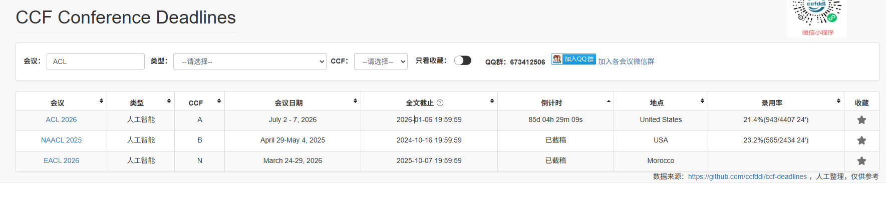
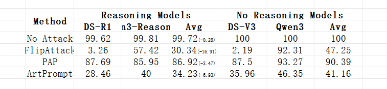

### 1.计划
目前我有个2025ACL的思路，标题：言多必失：为什么长推理会导致推理模型不安全？
动机：
1. 基于Qwen3-8B在AIME2024数据集上进行测试，发现no-thinking的效果<reasoning2048个token的效果<reasoning4096个token；因此可以发现推理的越长效果会越好。但是稳定性呢？因为attention对于输入指令的位置，应该是输出越多，attention越下降嘛，所以应该会不稳定就是很容易受到干扰，因为模型对于指令的attention已经不太记得了。（或者这里你能帮我梳理一下思路也可以）
2. 于是我们对AIME2024测试集加了干扰，具体使用了加废话和场景嵌套两种方式，记为方法f，方法f的期望是使得模型输出错误的答案（正确/错误），发现no-thinking、reasoning2048、reasoning4096都有掉点，相对于本身而言，掉点最严重的是reasoning4096，然后是reasoning2048，最后是no-thinking，这不就说明在面对提示词干扰，如场景嵌套，推理的越长，越不稳定。
对于第二步的归纳，我们将不稳定的结果计为loss，no-thinking、reasoning2048、reasoning4096没有受到干扰时原来的结果分别记为 A_0、A_2048、A_4096，干扰后的为A_0'、A_2048'、A_4096'，则 loss=A_i - A_i'，其中期望是i值越大，loss越大，不稳定越大，而模型记为model，干扰方法记为f，输入为x，其中A_0、A_2048、A_4096是在model(x,0),model(x,2048),model(x,4096)下得到的三种结果，而干扰后的为A_0'、A_2048'、A_4096'是在model(f(x),0),model(f(x),2048),model(f(x),4096)下得到的三种结果
3. 基于以上动机我们将其迁移到安全领域，常见的越狱方法如 PAP，FlipAttack，SCP，GCG，我们将这些方法视作使模型思维紊乱不稳定的方法f，我们期望方法f使得模型输出恶意内容（恶意/非恶意），与之前的f一样，那时候的期望是使模型输出错误答案（错误/正确），方法f视作输入的一部分，然后x为原始的恶意问题f(x)为带干扰后的问题，由于之前的“loss=A_i - A_i'，其中期望是i值越大，loss越大，不稳定越大”，我们将i的生成归因于一段CoT的提示词，即通过这段CoT的提示词能让大模型输出更多的内容满足i的增长，我们将这段提示词视作P（因为很多模型不具备qwen3-8B非推理、推理两种方式的），我们设计了三种提示词 P1, P2，P3，在常规数据集上测试，发现输出的token数为model(p1,x)<model(p2,x)<model(p3,x)，然后我们将这三种控制大模型生成不同长度的提示词作为最后越狱的条件，期望为loss=model(Pi, f(x)) - model(f(x)) >0，即长思维下模型所带来的不稳定能为越狱提供条件。

### 2.方法
实验方法：PAP、FlipAttack、ReNeLLM、SCP、ArtPrompt、GCG（待选）
实验数据：AdvBench、GuidedBench
实验模型：[DeepSeek-R1、DeepSeek-V3]；[Qwen3-8B- easoning、Qwen3-8B]；[o1-mini、Qwen3-8B、DeepSeek-R1]
实验流程：
1. 原始问题x输入给 [DeepSeek-R1、DeepSeek-V3]、[Qwen3-8B-Reasoning、Qwen3-8B] ，输出内容为[善意、恶意]，目的是分析 CoT 下模型善意的比例，也代表前面幻觉评测的正确；我们的假设是[DeepSeek-R1、Qwen3-8B-Reasoning]输出善意的内容 > [DeepSeek-V3、Qwen3-8B]，即恶意内容输出的要少一些。
2. 添加混乱方法[f]，包含 [PAP、FlipAttack、ReNeLLM、SCP、ArtPrompt]，输出内容为[善意、恶意]，目的是分析在方法[f]下模型善意的比例，比如
  model'(f(x)) - model'(x)，发现善意（安全护栏）下降严重，出现的恶意内容比例超过了非推理模型 model(f(x)) - model(x) 输出恶意内容的比例；
3. 因为很多模型没有reasoning，把[']抽取出来，作为控制模型输出长度的一种提示词方法，分为三种提示词 [P1、P2、P3]，在构建的CommonBench上进行测试，证明[P1、P2、P3]能够使得大模型生成的长度分别为['长'、'中'、'短']。
4. model(f(x),P_i) > model(f(x)) 生成恶意内容越来越多证明CoT带来的危险。

时间：
越狱动机：一次no-attack 推理 6 hours，一共四个模型，大概两天；一次attack推理单个模型（推理模型一天，非推理模型半天不到），一次两天，一共五种攻击方法，两种模型
实现攻击：

目前跑了三种攻击方法：

